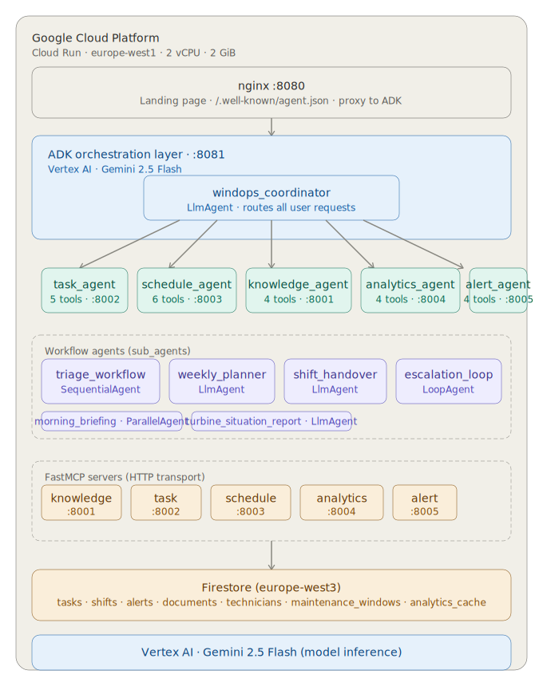
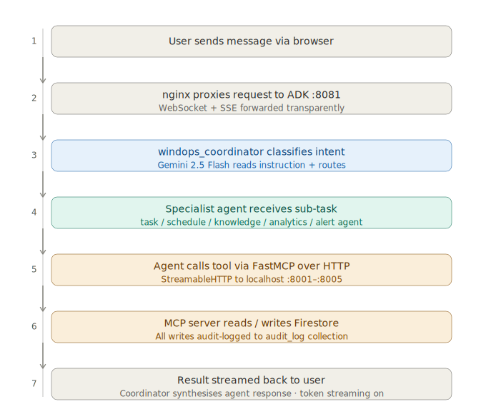

# WindOps Assistant

A multi-agent AI system for wind farm operations. Built on Google ADK with Gemini 2.5 Flash, it handles maintenance task management, technician scheduling, anomaly alerts, and operational analytics across 15 turbines — all through a conversational interface.

**Live demo:** https://wind-ops-assistant-cnd5nx432a-ew.a.run.app

---

## What it does

Wind farm operations teams deal with fragmented tooling, manual shift handovers, and reactive maintenance. WindOps replaces that with a single conversational interface backed by a coordinator agent that routes requests to five specialist agents — each owning a specific domain and a set of tools.

A technician can ask:
- "What P1 alerts are open on T-007?" → routed to alert_agent
- "Schedule Ahmed for morning shift on Thursday" → routed to schedule_agent
- "Create a task: inspect gearbox on T-012, P2" → routed to task_agent
- "Run the morning briefing" → triggers parallel_morning_briefing workflow

---

## Architecture

### System overview



### Request flow



### Agent design

The coordinator (`windops_coordinator`) is an `LlmAgent` that reads every incoming message and routes it to the right specialist using ADK's `transfer_to_agent` mechanism. It does not call tools directly.

**Specialist agents** — each is an `LlmAgent` connected to one FastMCP server:

| Agent | MCP server | Tools |
|---|---|---|
| task_agent | :8002 | create_task, list_tasks, update_task, bulk_update_tasks, get_task_stats |
| schedule_agent | :8003 | get_schedule, create_shift, update_shift, list_technicians, get_maintenance_windows, create_maintenance_window |
| knowledge_agent | :8001 | store_document, search_docs, get_document, list_documents |
| analytics_agent | :8004 | get_turbine_health, get_fleet_summary, get_technician_workload, get_analytics_cache |
| alert_agent | :8005 | create_alert, list_alerts, acknowledge_alert, escalate_alert |

**Workflow agents** — orchestrate multi-step operations:

| Agent | Type | What it does |
|---|---|---|
| triage_workflow | SequentialAgent | alert → knowledge → task → schedule: full fault intake chain with audit trail |
| weekly_planner | LlmAgent | Pulls schedule, tasks, analytics, and reporting in one pass |
| shift_handover | LlmAgent | Summarises open tasks, relevant docs, and active alerts for incoming shift |
| escalation_loop | LoopAgent (max 3) | Re-checks unacknowledged P1 alerts and escalates if unresolved |
| parallel_morning_briefing | ParallelAgent | Runs analytics + task + schedule + alert agents concurrently, merges output |
| turbine_situation_report | LlmAgent | Full situational report for a single turbine on demand |

`triage_workflow` uses `SequentialAgent` because each step has side effects the next step depends on — the alert must exist before the knowledge base is queried, the task must be created before the schedule is updated. The other workflows use single `LlmAgent` instances to avoid output duplication from chained sequential steps with no data dependency.

---

## Stack

```
Google ADK 1.27.4 · Gemini 2.5 Flash · Vertex AI
FastMCP 3.1.1 · Firestore (europe-west3)
Cloud Run (europe-west1) · nginx · Docker
Python 3.12
```

---

## Project structure

```
wind_ops_assistant/
├── agent.py                  # Root coordinator + 5 specialist LlmAgents
├── sub_agents/
│   ├── workflow_agents.py    # 6 workflow agents
│   ├── task_agent.py
│   ├── schedule_agent.py
│   └── knowledge_agent.py
├── tools/
│   ├── task_tools.py
│   ├── schedule_tools.py
│   ├── knowledge_tools.py
│   ├── analytics_tools.py
│   └── alert_tools.py
├── mcp_server/
│   ├── knowledge_mcp_server.py   # FastMCP :8001
│   ├── task_mcp_server.py        # FastMCP :8002
│   ├── schedule_mcp_server.py    # FastMCP :8003
│   ├── analytics_mcp_server.py   # FastMCP :8004
│   └── alert_mcp_server.py       # FastMCP :8005
├── db/
│   ├── firestore_client.py
│   ├── seed_data.py
│   └── reseed.py
├── static/
│   ├── index.html                # Landing page
│   ├── agent.json                # A2A agent card
│   └── architecture/
│       ├── windops_architecture.svg
│       └── windops_request_flow.svg
├── nginx.conf                    # Reverse proxy: landing at /, ADK at /dev-ui
├── start.sh                      # Startup: MCP servers → ADK :8081 → nginx :8080
├── Dockerfile
├── cloudbuild.yaml
└── requirements.txt
```

---

## Firestore collections

| Collection | Purpose |
|---|---|
| tasks | Maintenance work orders (P1–P3, status, assignment) |
| shifts | Technician shift schedules |
| maintenance_windows | Planned downtime windows per turbine |
| documents | Knowledge base entries (fault reports, field notes) |
| technicians | Technician profiles and availability |
| alerts | Active fault alerts with priority and acknowledgement state |
| analytics_cache | Cached turbine health and fleet KPI snapshots |

---

## Running locally

```bash
# Install dependencies
pip install -r requirements.txt

# Set environment variables
export GOOGLE_CLOUD_PROJECT=your-project-id
export GOOGLE_CLOUD_LOCATION=europe-west3
export GOOGLE_GENAI_USE_VERTEXAI=TRUE

# Seed Firestore
python db/reseed.py

# Start MCP servers (5 separate terminals or background processes)
python mcp_server/knowledge_mcp_server.py &
python mcp_server/task_mcp_server.py &
python mcp_server/schedule_mcp_server.py &
python mcp_server/analytics_mcp_server.py &
python mcp_server/alert_mcp_server.py &

# Start ADK
adk web --host 0.0.0.0 --port 8080 /agents
```

---

## Deploying to Cloud Run

```bash
gcloud builds submit --config cloudbuild.yaml --project=your-project-id
```

Requires Artifact Registry repo `wind-ops-repo` in `europe-west1`. Cloud Run service is configured for 2 vCPU and 2 GiB RAM — necessary to run 5 MCP servers + ADK concurrently without OOM.

---

## APAC relevance

India has 46 GW of installed wind capacity with aggressive 2030 expansion targets. Australia, Vietnam, and the Philippines are scaling offshore and onshore wind rapidly. The operational bottleneck across APAC wind farms is consistent: fragmented tooling, manual shift handovers, and reactive rather than predictive maintenance. WindOps addresses this directly — a single conversational interface that reduces mean time to resolution and keeps turbines generating.

---

## Built for

Gen AI Academy APAC — Cohort 1 Hackathon
